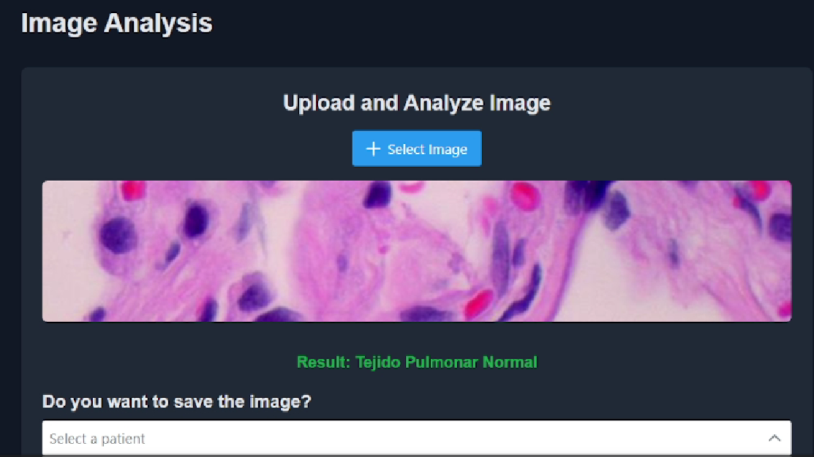

# Hackathon Microsoft Project - Asistente Médico para Análisis de Documentos, Imágenes y Gestión de Citas

Este proyecto fue desarrollado para el **Hackathon Microsoft** y está pensado como un **Asistente Integral para Médicos**. Utiliza **Next.js** en el frontend y **FastAPI** en el backend, integrándose con servicios de **Azure** para procesamiento de documentos e imágenes. Además, incluye un **sistema de citas para pacientes** que ayuda a médicos y personal de salud a gestionar y organizar citas de manera eficiente.

# Hackathon Microsoft Project - Asistente Médico para Análisis de Documentos, Imágenes y Gestión de Citas

Este proyecto fue desarrollado para el **Hackathon Microsoft** y está pensado como un **Asistente Integral para Médicos**...

## Capturas de Pantalla

### 1. Estructura del Proyecto


### 1. Estructura del Proyecto


### 2. Dashboard Principal


### 3. Panel de Citas


### 4. Formulario para Agregar Cita


### 5. Análisis de Imágenes


- **Frontend**: Next.js para la interfaz de usuario y la interacción con el usuario.
- **Backend**: FastAPI para la gestión de la API y el procesamiento de documentos.
- **Azure**: Usado para procesamiento de documentos, inteligencia en la nube y almacenamiento.

<!-- Añade una captura de pantalla de la estructura de carpetas -->

## ¿Por qué es útil este asistente para médicos?

Este asistente es ideal para médicos y personal de salud que buscan mejorar su eficiencia y brindar una mejor atención a sus pacientes. Las funcionalidades de este sistema permiten:

- **Automatizar el análisis de documentos e imágenes**: Reducción de tiempo en la revisión de documentos médicos y análisis de imágenes.
- **Facilitar la organización de citas para pacientes**: Permite a los médicos ver y gestionar las citas de los pacientes, evitando dobles reservas y mejorando la organización.
- **Brindar una experiencia integral a los pacientes**: Al tener una plataforma unificada, los pacientes pueden sentirse más atendidos y recibir sus resultados de análisis y citas de manera eficiente.


## Diagnóstico Inteligente de Imágenes

Al probar con una imagen, el sistema diagnostica la clase a la que pertenece sin incluir datos engorrosos de probabilidades de todas las clases. Simplemente muestra la clase con la mayor probabilidad y da el diagnóstico directo.

**Prueba el modelo de manera individual y explora el rendimiento general en Google Colab:**

- [Notebook de Entrenamiento y Prueba Individual](https://colab.research.google.com/drive/1hUWIMh6RGnSzpt2-6tAZikKf7DUKLUi5?usp=sharing) - Utilizado para entrenar y probar el modelo con imágenes individuales.
- [Notebook de Prueba en Conjunto de Datos](https://colab.research.google.com/drive/1J1bFDwqymnF98QYRxbeHLJI0SoPdVO6G?usp=sharing) - Para evaluar el rendimiento general del modelo en un conjunto de datos de prueba.


## Estructura del Proyecto

La estructura del proyecto es la siguiente:

```plaintext
├── frontend/                # Aplicación Next.js
│   ├── pages/               # Páginas y rutas
│   ├── components/          # Componentes de la interfaz
│   ├── public/              # Recursos estáticos
│   └── README.md            # Información del frontend
├── backend/                 # API en FastAPI
│   ├── routers/             # Rutas API organizadas
│   ├── models/              # Modelos de datos
│   └── main.py              # Archivo principal de FastAPI
└── README.md                # Descripción general del proyecto
para el Front-end  [Next.js](https://nextjs.org) project bootstrapped with [`create-next-app`](https://nextjs.org/docs/pages/api-reference/create-next-app).

## Getting Started

First, run the development server:

```bash
npm run dev
# or
yarn dev
# or
pnpm dev
# or
bun dev
```

Open [http://localhost:3000](http://localhost:3000) with your browser to see the result.

You can start editing the page by modifying `pages/index.tsx`. The page auto-updates as you edit the file.

[API routes](https://nextjs.org/docs/pages/building-your-application/routing/api-routes) can be accessed on [http://localhost:3000/api/hello](http://localhost:3000/api/hello). This endpoint can be edited in `pages/api/hello.ts`.

The `pages/api` directory is mapped to `/api/*`. Files in this directory are treated as [API routes](https://nextjs.org/docs/pages/building-your-application/routing/api-routes) instead of React pages.

This project uses [`next/font`](https://nextjs.org/docs/pages/building-your-application/optimizing/fonts) to automatically optimize and load [Geist](https://vercel.com/font), a new font family for Vercel.

ng-your-application/deploying) for more details.
