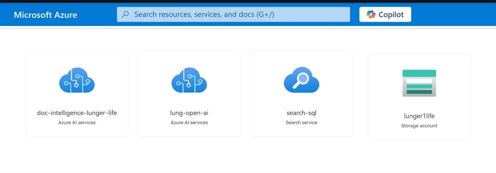

+++
# Hackathon Microsoft Project - Asistente Médico para Análisis de Documentos, Imágenes y Gestión de Citas

Este proyecto fue desarrollado como parte del **Hackathon Microsoft** y está diseñado como un **Asistente Integral para Médicos**. La aplicación utiliza **Next.js** para el frontend y **FastAPI** para el backend, integrándose con servicios de **Azure** para el procesamiento de documentos e imágenes. Además, incluye un **sistema de gestión de citas** para pacientes, ayudando a médicos y personal de salud a organizar sus citas de manera eficiente.

## Tabla de Contenidos

1. [Capturas de Pantalla](#capturas-de-pantalla)
2. [Características Clave](#características-clave)
3. [Diagnóstico Inteligente de Imágenes](#diagnóstico-inteligente-de-imágenes)
4. [Tareas y Colaboración](#tareas-y-colaboración)
5. [Herramientas Utilizadas](#herramientas-utilizadas)
6. [Estructura del Proyecto](#estructura-del-proyecto)
7. [Inicio Rápido](#inicio-rápido)

---

## Capturas de Pantalla

### 1. Estructura del Proyecto
   - **Frontend**: 
   - **Backend**: 

### 2. Interfaz de Usuario
   - **Dashboard Principal**: 
   - **Panel de Citas**: 
   - **Formulario para Agregar Cita**: 
   - **Análisis de Imágenes**: 
   - **Análisis de Documentos**: 

---

## Características Clave

Este asistente médico está diseñado para mejorar la eficiencia y la experiencia tanto del personal de salud como de los pacientes, con funcionalidades como:

- **Automatización del análisis de documentos e imágenes**: Ahorra tiempo en la revisión de documentos y el análisis de imágenes médicas.
- **Gestión eficiente de citas**: Los médicos pueden visualizar y organizar las citas de los pacientes, evitando conflictos de horarios y mejorando la organización.
- **Interfaz unificada para los pacientes**: Los pacientes reciben una atención más integral y acceso rápido a sus resultados de análisis y citas.

---

## Diagnóstico Inteligente de Imágenes

El sistema permite la clasificación de imágenes, mostrando directamente la clase de mayor probabilidad sin sobrecargar con datos innecesarios. Esto facilita un diagnóstico rápido y eficaz.

**Pruebas del modelo en Google Colab**:

- [Entrenamiento y Prueba Individual](https://colab.research.google.com/drive/1hUWIMh6RGnSzpt2-6tAZikKf7DUKLUi5?usp=sharing): Permite entrenar y probar el modelo con imágenes individuales.
- [Prueba en Conjunto de Datos](https://colab.research.google.com/drive/1J1bFDwqymnF98QYRxbeHLJI0SoPdVO6G?usp=sharing): Evalúa el rendimiento general del modelo en un conjunto de datos de prueba.

---

## Tareas y Colaboración

Para la gestión de tareas, se utilizó **Trello**, donde se documentaron los avances y el uso de las distintas tecnologías del proyecto.

- [Tablero de Trello](https://trello.com/invite/b/65093674f4b933675de63524/ATTI39837439f2f76b9f2f3a9e634efe6c14A1FE872A/hackahton-grupo-13): Aquí puedes ver el detalle de las tareas y tecnologías empleadas.

---

## Herramientas Utilizadas

Se integraron varias herramientas para potenciar las funcionalidades del proyecto:

- **Azure**: Procesamiento de documentos, inteligencia en la nube y almacenamiento.
- **Next.js** y **FastAPI**: Para el frontend y backend, respectivamente.




---

## Estructura del Proyecto

La estructura del proyecto está organizada de la siguiente manera:

```plaintext
├── frontend/                # Aplicación Next.js
│   ├── pages/               # Páginas y rutas
│   ├── components/          # Componentes de la interfaz
│   ├── public/              # Recursos estáticos
│   └── README.md            # Información del frontend
├── backend/                 # API en FastAPI
│   ├── routers/             # Rutas API organizadas
│   ├── models/              # Modelos de datos
│   └── main.py              # Archivo principal de FastAPI
└── README.md                # Descripción general del proyecto
```

Para iniciar el frontend de Next.js, el proyecto fue creado con [`create-next-app`](https://nextjs.org/docs/pages/api-reference/create-next-app).

---

## Inicio Rápido

Para comenzar a desarrollar el proyecto, ejecuta el servidor de desarrollo:

```bash
npm run dev
# o
yarn dev
# o
pnpm dev
# o
bun dev
```

Abre [http://localhost:3000](http://localhost:3000) en tu navegador para ver el resultado. Puedes editar la página modificando `pages/index.tsx`, y la aplicación actualizará automáticamente los cambios.

Las [rutas de API](https://nextjs.org/docs/pages/building-your-application/routing/api-routes) pueden ser accedidas en [http://localhost:3000/api/hello](http://localhost:3000/api/hello) y se encuentran en el directorio `pages/api`. 

Este proyecto también utiliza [`next/font`](https://nextjs.org/docs/pages/building-your-application/optimizing/fonts) para la optimización de fuentes.
+++